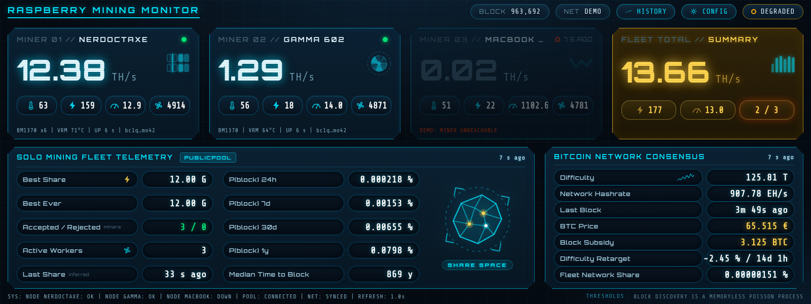
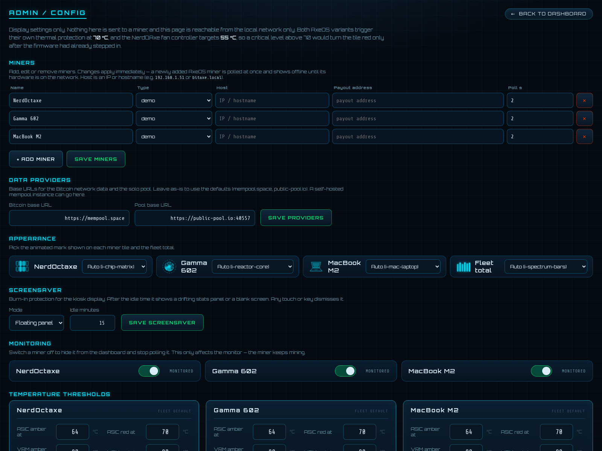

# Raspberry-Mining-Monitor

A lightweight, open-source Bitcoin solo-mining operations dashboard for
AxeOS-compatible miners.

Designed for small always-on systems such as the Raspberry Pi and optimized
for ultrawide touch displays.

Raspberry Mining Monitor combines miner telemetry, pool statistics and Bitcoin network
data into a single real-time dashboard.

> This project is currently under development.

## Screenshots

The dashboard, running in demo mode at 1600 × 600 (Waveshare 9.3"):

The admin / config page — reachable from the local network — where you can add,
edit and remove miners, set the data-provider URLs, pick an animated mark per
miner from eight designs, choose the screensaver mode, toggle monitoring, and
tune temperature thresholds:

## What it will show

### Miner telemetry

Monitor multiple AxeOS / ESP-Miner compatible devices:

- Hashrate
- ASIC temperature
- VRM temperature
- Power consumption
- Efficiency (J/TH)
- Frequency and voltage
- Fan speed
- Uptime
- Accepted / rejected shares
- Best share / best difficulty
- Pool connection status

### Bitcoin network

Display relevant Bitcoin network information:

- Current block height
- Network difficulty
- Estimated network hashrate
- Time since last block
- Block subsidy
- Solo-mining probability

### Combined mining statistics

Multiple miners can be aggregated into one mining operation:

    NerdOctaxe       ~12.0 TH/s
    Bitaxe Gamma     ~1.3 TH/s
    ----------------------------
    TOTAL            ~13.3 TH/s

The dashboard calculates combined hashrate, power consumption, efficiency
and estimated solo block probabilities.

## Target Setup

Initial reference hardware:

### Dashboard

- Raspberry Pi 4 Model B
- 1 GB RAM
- Raspberry Pi OS
- Waveshare 9.3" capacitive touchscreen
- 1600 × 600 resolution

### Miners

- NerdOctaxe Rev 3.1
- Bitaxe Gamma 602
- Other AxeOS-compatible miners planned

The miners connect directly to their configured mining pool.

Raspberry Mining Monitor is monitoring infrastructure only and is **not part of the
mining path**.

If the dashboard or Raspberry Pi is offline, mining continues normally.

## Architecture

    Bitcoin Network
          │
          │
       Solo Pool
          │
       Stratum
          │
     ┌────┴─────┐
     │          │
 NerdOctaxe   Bitaxe
     │          │
     └────┬─────┘
          │
       AxeOS API
          │
          ▼
 ┌──────────────────────────┐
 │ Raspberry Mining Monitor │
 │                          │
 │ Collector                │
 │ Metrics                  │
 │ Probability              │
 │ Dashboard                │
 └────────────┬─────────────┘
              │
              ▼
      1600 × 600 Display

## Dashboard Concept

The primary screen is designed as a compact Bitcoin mining operations center:

    ┌───────────────────────────────────────────────────────────────┐
    │ RASPBERRY MINING MONITOR               BLOCK 963xxx  ● ONLINE │
    ├───────────────────┬───────────────────┬───────────────────────┤
    │ NERDOCTAXE        │ GAMMA 602         │ TOTAL                 │
    │                   │                   │                       │
    │ 12.10 TH/s        │ 1.27 TH/s         │ 13.37 TH/s            │
    │ 62°C              │ 55°C              │ 176 W                 │
    │ 158 W             │ 18 W              │ 13.2 J/TH             │
    ├───────────────────┴───────────────────┼───────────────────────┤
    │ SOLO MINING                           │ BITCOIN NETWORK       │
    │ Best share       18.7 G               │ Difficulty   xx.x T   │
    │ Accepted          1,284               │ Hashrate     xxx EH/s │
    │ Rejected              2               │ Last block   03:42    │
    │ Block probability ...                 │ Subsidy      3.125 BTC│
    └───────────────────────────────────────┴───────────────────────┘

## Design Goals

The project follows five priorities:

1. Security
2. Reliability
3. Low resource usage
4. Clear observability
5. Simple, attractive UI

The application is intentionally lightweight enough to run 24/7 on a
Raspberry Pi with limited memory.

## Security

Raspberry Mining Monitor is designed as a **read-only monitoring system**.

It does not require or store:

- Bitcoin private keys
- Seed phrases
- Wallet passwords
- Hardware-wallet secrets

A miner never needs access to Bitcoin private keys.

Only public mining information and public Bitcoin addresses may be used where
required by pool APIs.

No telemetry, analytics or developer-fee functionality is planned.

## Development

Primary development platform:

    MacBook Pro
    Apple Silicon
    macOS

Production target:

    Raspberry Pi 4
    ARM64
    Raspberry Pi OS

### Quick start

Demo mode needs no miners, no config file and no internet:

    make demo

Then open http://127.0.0.1:8080. All miner, pool and network data is
simulated, including occasional dropouts so the offline and stale states are
visible while developing.

Other targets:

    make test    # run the test suite
    make race    # run it under the race detector
    make build   # build ./rmm for this machine
    make pi      # cross-compile a static ARM64 binary for the Raspberry Pi

For real hardware, copy `deploy/config.example.yaml` to `config.yaml`, fill in
your miner addresses, and run `./rmm`. The config file is the only place an IP
or a payout address belongs.

### Deploy to a Raspberry Pi

The Pi needs no Go toolchain. The binary is cross-compiled on the dev machine
and copied over. Set the target once in `deploy/deploy.env` (gitignored):

    RMM_SSH=my-pi          # ssh alias or user@host
    RMM_TARGET=~/rmm       # directory on the Pi

then:

    ./deploy/deploy.sh              # build, upload, verify checksum, place
    ./deploy/deploy.sh --restart    # also restart the systemd service

`deploy/rmm.service` is a hardened systemd unit for running it unattended.

## Roadmap

### Phase 0 — Architecture
- Technology selection
- AxeOS API research
- Pool API research
- Bitcoin data provider
- UI design
- Raspberry Pi resource budget

Written up in [docs/PHASE-0-DESIGN-REVIEW.md](docs/PHASE-0-DESIGN-REVIEW.md).

### Phase 1 — Demo (done)
- 1600 × 600 dashboard
- Simulated miners
- Simulated Bitcoin network
- Solo probability calculations

### Phase 2 — AxeOS (done)
- Read-only AxeOS integration, both firmware variants
- Variant auto-detection (Bitaxe vs NerdQAxe)
- Multiple miners
- Health and stale-data detection

### Phase 3 — Bitcoin (done)
- Live Bitcoin network data from mempool.space
- Difficulty, network hashrate, block height and timing
- Retarget estimate; subsidy computed locally from height
- Provider abstraction (public API now, Bitcoin Core RPC later)

### Phase 4 — Solo Pools (done)
- Public Pool adapter: one query per payout address, best difficulty aggregated
- Worker hashrate normalised from H/s to TH/s
- Capability gating for metrics Public Pool cannot supply
- solo.ckpool.org adapter later

### Phase 5 — History (done)
- Rolling fleet history over 1 h / 24 h / 7 d
- Hashrate, power and BTC price charts (canvas, no chart library)
- Lightweight in-RAM rings persisted to a small file (no database, few SD writes)

### Phase 6 — Raspberry Pi (in progress)
- Console launcher to choose which project to run (`deploy/launcher/`)
- Full-screen Chromium kiosk via cage (`deploy/kiosk/`)
- tty1 autologin with a countdown that defaults to the kiosk
- systemd service and Waveshare timings still to finalise

### Future

Potential future extensions include:

- Local Bitcoin Core integration
- Bitcoin Core RPC data provider
- Own Stratum proxy / solo pool
- Prometheus exporter
- Grafana integration
- Additional AxeOS miners
- Alerts
- Mobile dashboard

## Why?

Solo mining is often reduced to a single number: hashrate.

Raspberry Mining Monitor is intended to make the complete process more visible:

    Bitcoin Network
           ↓
       Solo Pool
           ↓
      Stratum Job
           ↓
       ASIC Miner
           ↓
       SHA-256d
           ↓
         Shares
           ↓
      Difficulty
           ↓
    Block Probability

The goal is not to make solo mining predictable.

It is to make it **observable and understandable**.

## Status

Phases 1 and 2 are complete. The simulated dashboard runs with `make demo`, and
the read-only AxeOS collector reads both firmware variants from real hardware:
Bitaxe (`bitaxeorg/ESP-Miner`) and NerdOctaxe (`shufps/ESP-Miner-NerdQAxePlus`),
detected automatically. Point `config.yaml` at your miners and run `./rmm`.

The backend is Go with one dependency (`yaml.v3`), and the frontend ships inside
the binary, so deployment is one file plus one config file. Phase 3 adds live
Bitcoin network data from mempool.space.

## License

MIT. See [LICENSE](LICENSE).
